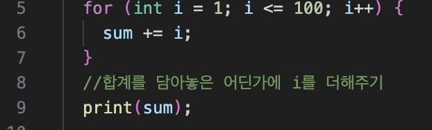

# 플러터 아침 스터디 기록

- 시작일자 : 2025년 12월 03일

## 목표
- [X] git 맛보기
- [ ] git 마스터
- [ ] 다트 마스터
- [ ] 플러터 마스터

## 레포지토리에 올리는법
### 최초일때
1. 깃허브 레포지토리 만들기
2. 폴더 만들기
3. VsCode에서 폴더 열고 올릴파일 만들기
4. 저장소 초기화 
    -  명령어 : `git init`
    -  초기화 하게되면 `.git` 폴더가 생긴다
5. 임시영역(스테이징 영역)에 파일 추가하기
    - 명령어 : `git add .` 
    - `add` 뒤에 `.` 은 현재 폴더 내의 모든 파일을 의미
    - 현재 폴더는 터미널에서의 작업 영역
6. 브랜치에 기록하기(최종 저장)
    - 명령어 : `git commit -m "커밋메시지"`
    - 커밋메세지는 어떠한 변경사항이 있었는지 메모용도    
7. 원격 저장소 연결
    - 명령어 (깃허브 레포지토리 윗블럭 가장 아랫줄 3줄)
   
    ```sh
    git remote add origin https://github.com/kiwikid1543-alt/flutter-study-9.git
    git branch -M main
    git push -u origin main
    ```
8. 깃허브에 올리기 (7번에 포함되어 있어서 안해도 됨)
    - 명령어 : `git push origin main`

### 이후
1. 임시영역(스테이징 영역)에 파일 추가하기
    - 명령어 : `git add .`
    - `add` 뒤에 `.` 은 현재 폴더 내의 모든 파일을 의미
    - 현재 폴더는 터미널에서의 작업 영역
2. 브랜치에 기록하기(최종 저장)
    - 명령어 : `git commit -m"커밋메시지"`
    - 커밋메세지는 어떠한 변경사항이 있었는지 메모용도 
3. 깃허브에 올리기 (7번에 포함되어 있어서 안해도 됨)
    - 명령어 : `git push origin main`, `git push`


## 꿀팁

- 맥에서 Option + 백틱 누르면 한글일떄도 백틱이 입력
    - by 지은성 2025.12.03
- 로컬저장소 원격저장소    
- VsCode에서 터미널열기 : `command + J`
- command shift . : 숨김파일보기
- 파일 수정 후에는 항상 저장해서 파일명 우측에 동그라미 없는지 확인!
- VsCode 멀티라인 선택 : option + command + 화살표
- switch, for 문 만들 때 VsCode 자동완성 기능 활용해서 전체블럭 만들기!
- 코드 라인수 옆에 클릭해서 빨간점(브레이크포인트) 만들면 `디버그보드`에서 해당줄부터 한줄씩 실행하면서 변수 확인 가능
 스크린샷: command+shift+4